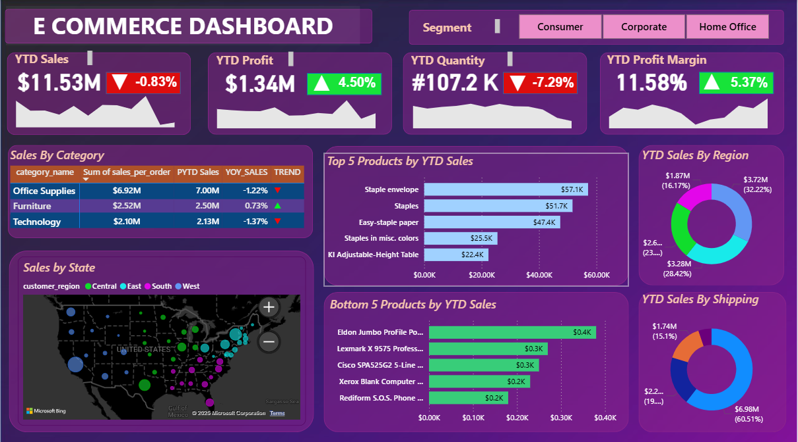

# E_Commerce_Sales
This repository contain the dashboard and readme file for my first project built in PowerBI for Ecommerce Sales.
# 📊 E-Commerce Power BI Dashboard

## 📌 Project Overview  
This Power BI dashboard provides an **end-to-end analysis of an E-Commerce business**. It highlights key performance metrics such as **sales, profit, quantity, and profit margin** across different segments, categories, regions, and products.  

The objective of this dashboard is to help management make **data-driven decisions** by identifying top-performing areas and opportunities for improvement.

---

## 🔑 Key Insights  

- **Overall Performance (YTD):**  
  - Sales: **$11.53M** (▼0.83%)  
  - Profit: **$1.34M** (▲4.50%)  
  - Quantity: **107.2K units** (▼7.29%)  
  - Profit Margin: **11.58%** (▲5.37%)  

- **Sales by Category:**  
  - Office Supplies generated the highest sales ($6.92M) but showed a **slight decline** in YoY sales.  
  - Furniture showed **growth (+0.73%)**, while Technology sales declined (-1.37%).  

- **Top Products:**  
  - Staple Envelope, Staples, and Easy-staple paper led the sales.  

- **Bottom Products:**  
  - Eldon Jumbo ProFile Pocket and Lexmark Printer models had the **lowest contribution**.  

- **Regional Sales:**  
  - The **West region** contributed the most sales ($3.72M), followed by **East and South**.  

- **Shipping Method Insights:**  
  - Standard Class dominated with **60.5% of sales**.  

---

## 🛠️ Tools & Skills Used  
- **Power BI** – Data visualization and dashboard creation  
- **DAX** – For calculated measures and KPIs  
- **Data Modeling** – Building relationships between sales, products, regions, and shipping  
- **Business Insights** – Identifying sales trends, top/bottom products, and regional performance  

---

## 🚀 How to Use  
1. Clone this repository.  
2. Open the `.pbix` file in **Power BI Desktop**.  
3. Explore the interactive dashboard.  

---

